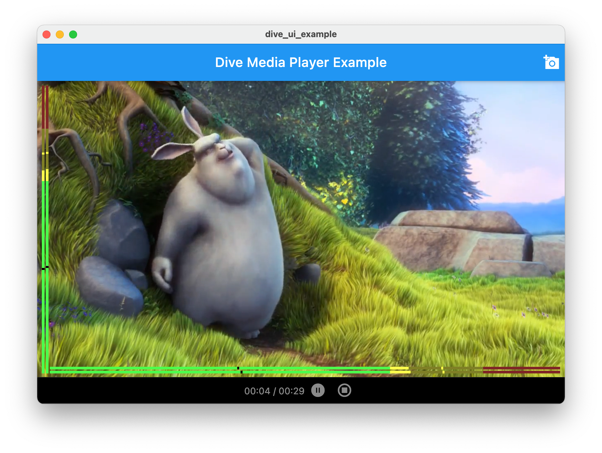
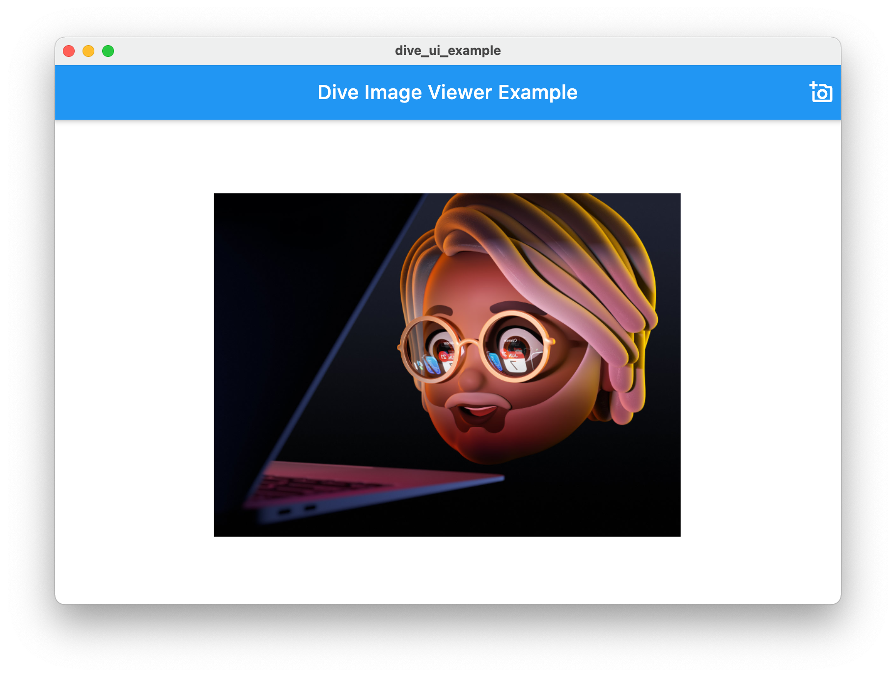
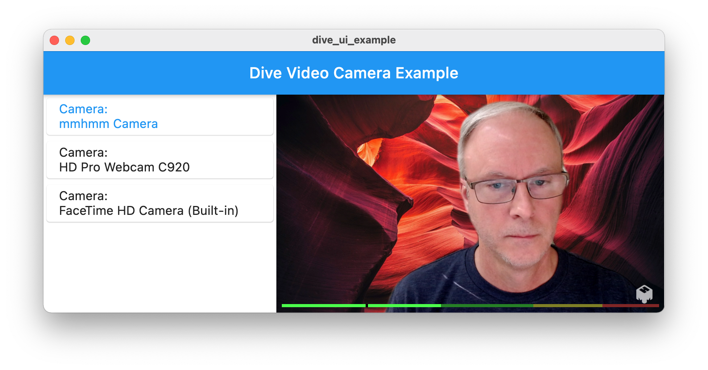

# Dive UI Examples

Demonstrates how to use the dive_ui plugin to build a media app.

## Example 1 - Media Player

This example shows how to use dive_ui, dive_core, and dive_obslib to build a
media player. This media player demonstrates these features using 129 lines of code:
* Display a file selector button `DiveVideoPickerButton` that opens the file selector dialog.
* Display a file selector dialog to select a media/video file.
* Use `DiveCoreElements` to track the scene, video mix (`DiveVideoMix`), audio source, and media source.
* Create a scene (`DiveScene`) and display the video mix using the `DiveMeterPreview` widget playing the video.
* Display audio meters in both horizontal and vertical orientations.
* Display media player control bar `DiveMediaButtonBar` with play/pause buttom, stop buttons, and elapsed
time.
* Usage: flutter run lib/main_example1.dart -d macos



## Example 2 - Image Viewer

This example shows how to use dive_ui, dive_core, and dive_obslib to display
an image in the video mix.
* Display a file selector button `DiveImagePickerButton` that opens the file selector dialog.
* Display a file selector dialog to select an image (bmp/tga/png/jpeg/jpg/gif/psd/webp) file.
* Use `DiveCoreElements` to track the scene, video mix (`DiveVideoMix`), audio source, and media source.
* Create a scene (`DiveScene`) and display the video mix using the `DiveMeterPreview` widget playing the video.
* Display audio meters in both horizontal and vertical orientations.
* Display media player control bar `DiveMediaButtonBar` with play/pause buttom, stop buttons, and elapsed
time.
* Usage: flutter run lib/main_example2.dart -d macos



## Example 3 - Video Cameras

This example shows how to use dive_ui, dive_core, and dive_obslib to display
multiple video cameras in a list, and select one for the video mix.
* Use `DiveCoreElements` to track the scene, video mix (`DiveVideoMix`), audio source, and video source.
* Create a scene (`DiveScene`) and display the video mix using the `DiveMeterPreview` widget showing the video mix.
* Create a DiveAudioSource for the main audio.
* Create a video source (`DiveVideoSource`) for each video input (`DiveInputs.video()`).
* Display an audio meter in the horizontal orientation on the video mix.
* Display the list of video camera sources in a list (`DiveCameraList`).
* Usage: flutter run lib/main_example3.dart -d macos



## Example 4 - Streaming

This example shows how to use dive_core and dive_obslib to create a non-UI
app that will stream to Twitch.
* Use `DiveCoreElements` to track the scene, audio source, and video source.
* Create a scene (`DiveScene`).
* Create a DiveAudioSource for the main audio.
* Create a video source (`DiveVideoSource`) for the last video input (`DiveInputs.video()`).
* Create the streaming output `DiveOutput`.
* Start streaming to Twitch.
* Usage: flutter run lib/main_example4.dart -d macos

## Example 5 - Multi Camera Mix

This example shows how to use dive_ui, dive_core, and dive_obslib to display
multiple video cameras in a list with preview, select one for the video mix,
animate to show all three cameras in mix, and stream to Twitch.
* Use `DiveCoreElements` to track the scene, video mix (`DiveVideoMix`), audio source, and video source.
* Create a scene (`DiveScene`) and display the video mix using the `DiveMeterPreview` widget showing the video mix.
* Create a DiveAudioSource for the main audio.
* Create a video source (`DiveVideoSource`) for each video input (`DiveInputs.video()`).
* Display an audio meter in the horizontal orientation on the video mix.
* Display the list of video camera sources in a list (`DiveCameraList`).
* Usage: flutter run lib/main_example5.dart -d macos

## Example 6 - Counter

This example shows how to run the counter sample without any dive_ui code, linking
in the obslib into the macos app.
* Usage: flutter run lib/main_example6.dart -d macos

## Example 7 - Audio Inputs

This example shows how to use dive_ui, dive_core, and dive_obslib to display
multiple audio inputs in a list, and select one for the video mix.
* Use `DiveCoreElements` to track the scene, video mix (`DiveVideoMix`), audio source, and video source.
* Create a scene (`DiveScene`) and display the video mix using the `DiveMeterPreview` widget showing the video mix.
* Create a DiveAudioSource for the main audio.
* Create a video source (`DiveVideoSource`) for each video input (`DiveInputs.video()`).
* Display an audio meter in the horizontal orientation on the video mix.
* Display the list of video camera sources in a list (`DiveCameraList`).
* Usage: flutter run lib/main_example5.dart -d macos


## Writing an app with Dive UI

1. Add dive_ui to your pubspec.yaml file.
1. In the macos/Podfile, in the target 'Runner' section, add: ```pod 'obslib', :path => '/Users/larry/Projects/obslib-framework'```
1. Open Xcode and load the Runner.xcworkspace file.
1. Select the Runner target, under the General tab. Change the Deployment Target to 10.13.
1. In section Signing & Capabilities, in the App Sandbox, check both Network boxes, 
Camera, Audio Input, USB, and in File Access set all to Read/Write.
1. In the Info section, add the Privacy keys for Desktop Folder, Camera, Microphone, Documents Folder,
and Downloads Folder.
1. In the Build Phases section, add a New Run Script Phase. Add this to the Shell:
```
# Copy the framework resources to a specific folder in the app Resources
cp -R ${TARGET_BUILD_DIR}/${FRAMEWORKS_FOLDER_PATH}/obslib.framework/Resources/data ${TARGET_BUILD_DIR}/${UNLOCALIZED_RESOURCES_FOLDER_PATH}
rsync ${TARGET_BUILD_DIR}/${FRAMEWORKS_FOLDER_PATH}/obslib.framework/PlugIns/* ${TARGET_BUILD_DIR}/${PLUGINS_FOLDER_PATH}
```
1. From command line: flutter run -d macos

## TODO - Examples to be created

1. Example showing how to display multiple audio inputs in a list, and select one for the video mix.
1. Example showing 720p and 1080p videos.
1. Example showing how to scrub a video forward and backward.
1. Example showing how to position an image in the mix.