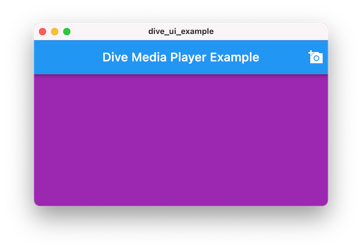

# dive_ui

A Flutter package (part of the [Dive](https://pub.dev/packages/dive) toolkit) containing widgets for building Flutter apps for
video recording and streaming.

## Introduction

Dive is a Flutter toolkit for video recording and streaming. The `dive_ui`
package is part of the Dive toolkit and is a complete set of widgets to build
the next generation of Flutter media apps. This package relies heavily on the
[dive](https://pub.dev/packages/dive) package but remains platform indepenent. There are many widgets in this package
and plenty of examples.

## Beta

_This version of Dive is in beta and is not intended for production use. This beta gives you
early access before the official release is available. If you run into any issues with Dive, please create a Dive GitHub
issue [here](https://github.com/larryaasen/dive/issues)._

# Getting Started (macOS only)

As of now, Dive only supports macOS Flutter desktop apps and Dart command line apps. You should probably
read more about [Desktop support for Flutter](https://docs.flutter.dev/development/platform-integration/desktop)
if you are not familiar with those.

Example code is the best way to explore and learn Dive.
There are many small example apps included in the `dive_ui` package. You should run those examples
first to get familiar with the widgets and classes that are part of Dive.

1. To download the examples, follow [this GitHub link](https://github.com/larryaasen/dive), click the green Code
button, click Download ZIP.
1. Once the repo has been downloaded, open/uncompress the zip file. It should create the folder `dive-main`.
1. Open the path `dive-main/packages/dive_ui/example` in an IDE such as [Visual Studio Code](https://code.visualstudio.com/) or Android Studio.
1. Navigate to packages > dive_ui > example > lib.
1. There you will see many example files.
1. Right click on main_example1.dart and run it.
1. If the macOS app does not build properly, you may have to make some path changes to get it working.
1. The app should run and appear like this:

1. Click the camera icon in the top right corner of the app window.
1. Select a video file from your local drive, such as an MP4 file, and click Open.
1. The video file should start playing immediately.
1. You should be able to see the player controls at the bottom of the screen. If you don't,
just resize the window until they appear. The player controls will not be displayed until
a video file is opened.

1. Now that you have successfully run the first `dive_ui` example, you can run the
other examples located in the same folder as `dive_ui/example/lib/main_example1.dart`.

If you run into any issues with these steps, please create a Dive GitHub
issue [here](https://github.com/larryaasen/dive/issues).

# Video Widgets
* DiveSourceCard - stack, gear menu, child
* DiveMediaPreview - stack, text, buttons
* DiveMeterPreview - A [DivePreview] with a [DiveAudioMeter] overlay using a [DiveAudioMeterSource].
* DivePreview - A widget showing a preview of a video/image frame using a [Texture] widget.
* DiveGrid - GridView

# Audio Widgets
* DiveAudioMeter: A widget to display a multi-channel audio meter.
* DiveAudioMeterSource: A class for the volume meter data and processing.

# Other Widgets
* DivePositionDialog - A dialog to update the position of a scene item.
* DivePositionEdit - Update the position of a scene item.
* DiveMoveItemEdit - Update the z-priority of a scene item.
* DiveSideSheet - Show a Material side sheet.
* DiveStreamSettingsButton - An icon button that presents the stream settings dialog.
* DiveStreamSettingsDialog - A dialog to update the video output settings.
* DiveTopicCard - A material design widget that creates a [Card] widget that contains content and actions about a single subject.
* DiveIconSet - The default icons for `dive_ui` widgets. Override these methods to provide custom icons.
* DiveUI - Contains the key setup method.
* DiveMediaPlayButton - Play media button.
* DiveMediaStopButton - Stop media button.
* DiveMediaDuration - Media duration text.
* DiveMediaButtonBar - A button bar containing DiveMediaDuration, DiveMediaPlayButton,
and DiveMediaStopButton.
* DiveOutputButton - Streaming output button.
* DiveStreamPlayButton - Streaming play button.
* DiveAspectRatio - A widget that will size the child to a specific aspect ratio.
* DiveGrid - A grid of widgets that maintains the aspect ratio.
* DiveSourceMenu - 
* DiveSubMenu - A popup menu.
* DiveImagePickerButton - An icon button that presents the image file picker dialog.
* DiveVideoPickerButton - An icon button that presents the video file picker dialog.
* DiveCameraList - A widget that displays a vertical list of the video cameras.
* DiveAudioList - A widget that displays a vertical list of the audio sources.
* DiveSettingsButton - An icon button that presents the settings dialog.
* DiveVideoSettingsDialog - A dialog to update the video output settings.

# Support

If you run into any issues with Dive, please create a Dive GitHub
issue [here](https://github.com/larryaasen/dive/issues).