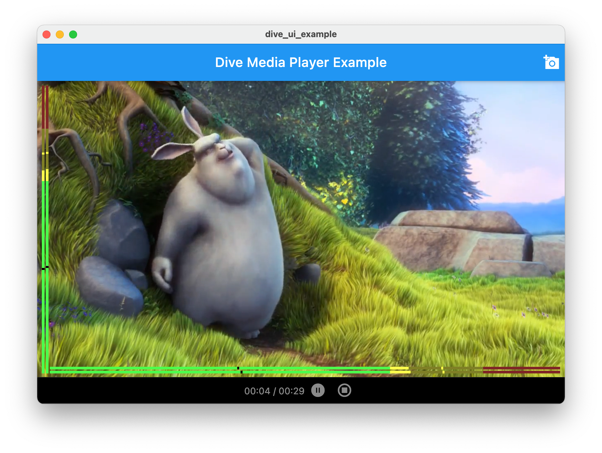
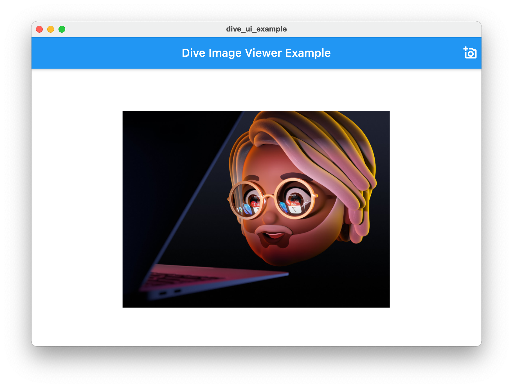
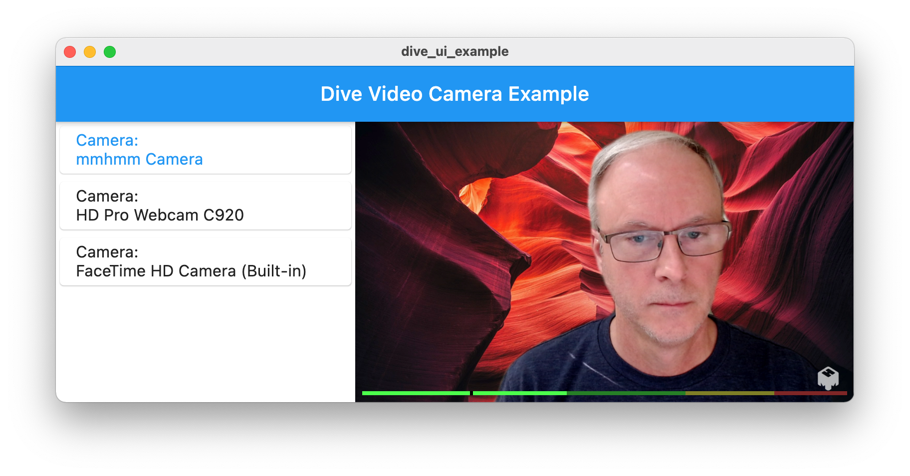
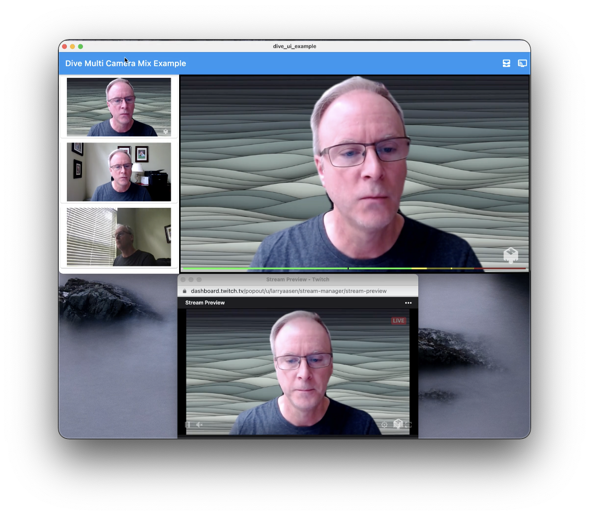
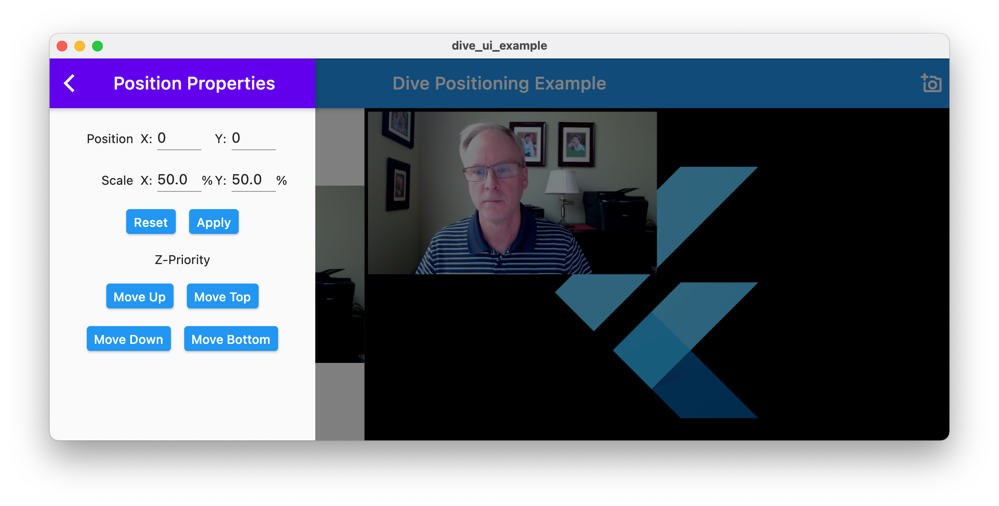
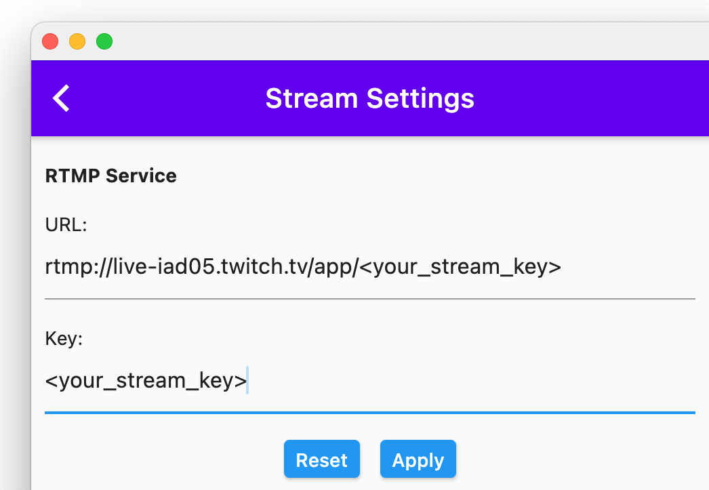

# Dive UI Examples

Demonstrates how to use the dive_ui plugin to build a media app.

## Example 1 - Media Player

This example shows how to use dive_ui, dive_core, and dive_obslib to build a
media player. This media player demonstrates these features using 129 lines of code:
* Display a file selector button `DiveVideoPickerButton` that opens the file selector dialog.
* Display a file selector dialog to select a media/video file.
* Use `DiveCoreElements` to track the scene, video mix (`DiveVideoMix`), audio source, and media source.
* Create a scene (`DiveScene`) and display the video mix using the `DiveMeterPreview` widget playing the video.
* Display audio meters in both horizontal and vertical orientations.
* Display media player control bar `DiveMediaButtonBar` with play/pause buttom, stop buttons, and elapsed
time.
* Usage: flutter run lib/main_example1.dart -d macos



## Example 2 - Image Viewer

This example shows how to use dive_ui, dive_core, and dive_obslib to display
an image in the video mix.
* Display a file selector button `DiveImagePickerButton` that opens the file selector dialog.
* Display a file selector dialog to select an image (bmp/tga/png/jpeg/jpg/gif/psd/webp) file.
* Use `DiveCoreElements` to track the scene, video mix (`DiveVideoMix`), audio source, and media source.
* Create a scene (`DiveScene`) and display the video mix using the `DiveMeterPreview` widget playing the video.
* Display audio meters in both horizontal and vertical orientations.
* Display media player control bar `DiveMediaButtonBar` with play/pause buttom, stop buttons, and elapsed
time.
* Usage: flutter run lib/main_example2.dart -d macos



## Example 3 - Video Cameras

This example shows how to use dive_ui, dive_core, and dive_obslib to display
multiple video cameras in a list, and select one for the video mix.
* Use `DiveCoreElements` to track the scene, video mix (`DiveVideoMix`), audio source, and video source.
* Create a scene (`DiveScene`) and display the video mix using the `DiveMeterPreview` widget showing the video mix.
* Create a `DiveAudioSource` for the main audio.
* Create a video source (`DiveVideoSource`) for each video input (`DiveInputs.video()`).
* Display an audio meter in the horizontal orientation on the video mix.
* Display the list of video camera sources in a list (`DiveCameraList`).
* Usage: flutter run lib/main_example3.dart -d macos



## Example 4 - Streaming

This example shows how to use dive_core and dive_obslib to create a non-UI
app that will stream to Twitch.
* Use `DiveCoreElements` to track the scene, audio source, and video source.
* Create a scene (`DiveScene`).
* Create a `DiveAudioSource` for the main audio.
* Create a video source (`DiveVideoSource`) for the last video input (`DiveInputs.video()`).
* Create the streaming output `DiveOutput`.
* Start streaming to Twitch.
* Usage: flutter run lib/main_example4.dart -d macos

## Example 5 - Multi Camera Mix

This example shows how to use dive_ui, dive_core, and dive_obslib to display
multiple video cameras in a list with preview, select one for the video mix,
animate to show all three cameras in mix, and stream to Twitch.
* Use `DiveCoreElements` to track the scene, video mix (`DiveVideoMix`), audio source, and video sources.
* Create a scene (`DiveScene`) and display the video mix using the `DiveMeterPreview` widget showing the video mix.
* Create a `DiveAudioSource` for the main audio.
* Create a video source (`DiveVideoSource`) for each video input (`DiveInputs.video()`).
* Display an audio meter in the horizontal orientation on the video mix.
* Display the list of video camera sources in a list (`DiveCameraList`).
* Display a `DiveOutputButton` used to start the stream.
* Usage: flutter run lib/main_example5.dart -d macos



## Example 6 - Counter

This example shows how to run the counter sample without any dive_ui code, linking
in the obslib into the macos app. Also shows the use of a popup menu.
* Usage: flutter run lib/main_example6.dart -d macos

## Example 7 - Audio Inputs

This example shows how to use dive_ui, dive_core, and dive_obslib to display
multiple audio inputs in a list.
* Use `DiveCoreElements` to track the scene, video mix (`DiveVideoMix`), audio sources, and video source.
* Create a scene (`DiveScene`) and display the video mix using the `DiveMeterPreview` widget showing the video mix.
* Create an audio source (`DiveAudioSource`) for each audio input.
* Create a video source (`DiveVideoSource`) for one video input (`DiveInputs.video()`).
* Display an audio meter in the vertical orientation on the video mix.
* Display the list of audio sources in a list (`DiveAudioList`).
* Usage: flutter run lib/main_example7.dart -d macos

## Example 8 - Positioning

This example shows how to use dive_ui, dive_core, and dive_obslib to
position a video camera in the video mix.
* Use `DiveCoreElements` to track the scene, video mix (`DiveVideoMix`), and video source.
* Create a scene (`DiveScene`) and display the video mix using the `DiveMeterPreview` widget showing the video mix.
* Display a file selector button `DiveImagePickerButton` that opens the file selector dialog to load an image.
* Show the [DiveSubMenu] popup menu.
* Show the [DivePositionDialog] dialog.
* Usage: flutter run lib/main_example8.dart -d macos



## Example 9 - Resolutions

This example shows how to use dive_ui, dive_core, and dive_obslib to
change the output resolution of the video mix.
* Use `DiveCoreElements` to track the scene, video mix (`DiveVideoMix`), and video source.
* Create a scene (`DiveScene`) and display the video mix using the `DiveMeterPreview` widget showing the video mix.
* Display a settings icon button `DiveSettingsButton` that opens the output settings dialog.
* Show the [DiveVideoSettingsDialog] dialog.
* Usage: flutter run lib/main_example9.dart -d macos

## Example 10 - Icon Set

This example shows how to use dive_ui, dive_core, and dive_obslib to
change the output resolution of the video mix.
* Use `DiveCoreElements` to track the scene, video mix (`DiveVideoMix`), and video source.
* Create a scene (`DiveScene`) and display the video mix using the `DiveMeterPreview` widget showing the video mix.
* Display a settings icon button `DiveSettingsButton` that opens the output settings dialog.
* Usage: flutter run lib/main_example10.dart -d macos

## Example 11 - Configure Stream

This example shows how to use dive_ui, dive_core, and dive_obslib to
configure the RTMP stream.
* Use `DiveCoreElements` to track the scene, video mix (`DiveVideoMix`), audio source, and video sources.
* Create a scene (`DiveScene`) and display the video mix using the `DiveMeterPreview` widget showing the video mix.
* Create a `DiveAudioSource` for the main audio.
* Create a video source (`DiveVideoSource`) for each video input (`DiveInputs.video()`).
* Display an audio meter in the horizontal orientation on the video mix.
* Display the list of video camera sources in a list (`DiveCameraList`).
* Display a `DiveStreamSettingsButton` to open the settings.
* Display a `DiveOutputButton` used to start the stream.
* Usage: flutter run lib/main_example11.dart -d macos



## Example 12 - Display Capture

This example shows how to create a display capture input type which is used for
streaming the computer screen.

## Example 13 - Live streaming

This example shows how to live stream with display capture, one camera overlay,
a mic input, and background music.

# Writing an app with Dive UI

1. Add dive_ui to your pubspec.yaml file.
2. In the macos/Podfile, in the target 'Runner' section, add: ```pod 'obslib', :path => '/Users/larry/Projects/obslib-framework'```
3. Open Xcode and load the Runner.xcworkspace file.
4. Select the Runner target, under the General tab. Change the Deployment Target to 10.13.
5. In section Signing & Capabilities, in the App Sandbox, check both Network boxes, 
Camera, Audio Input, USB, and in File Access set all to Read/Write.
6. In the Info section, add the Privacy keys for Desktop Folder, Camera, Microphone, Documents Folder,
and Downloads Folder.
7. In the Build Phases section, add a New Run Script Phase. Add this to the Shell:
```
# Copy the framework resources to a specific folder in the app Resources
cp -R ${TARGET_BUILD_DIR}/${FRAMEWORKS_FOLDER_PATH}/obslib.framework/Resources/data ${TARGET_BUILD_DIR}/${UNLOCALIZED_RESOURCES_FOLDER_PATH}
rm -fr ${TARGET_BUILD_DIR}/${UNLOCALIZED_RESOURCES_FOLDER_PATH}/data/obs-mac-virtualcam.plugin
rsync ${TARGET_BUILD_DIR}/${FRAMEWORKS_FOLDER_PATH}/obslib.framework/PlugIns/* ${TARGET_BUILD_DIR}/${PLUGINS_FOLDER_PATH}
```

Note: The folder obs-mac-virtualcam.plugin is in the wrong folder, data, and will
fail validation by Apple, so it has been removed for now.

8. From command line: flutter run -d macos

# TODO - Examples to be created
1. Example showing how to scrub a video forward and backward.
1. Example of live streaming setup with multiple services using dropdown list.
1. Example showing how to position an image in the mix.
1. Example showing how to change the volume of an audio source.
1. Example showing how to save settings.
1. Create example with all widgets displayed.
